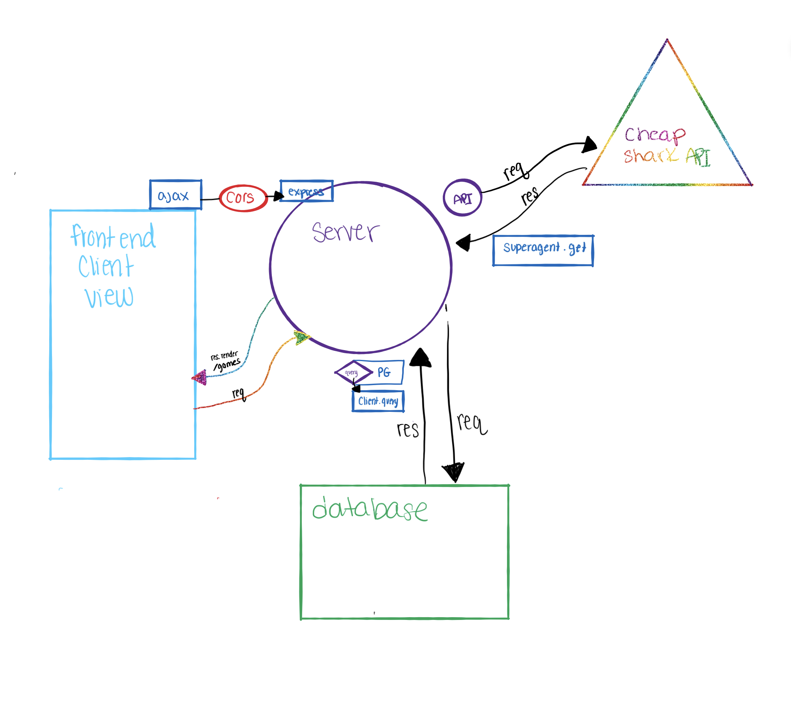
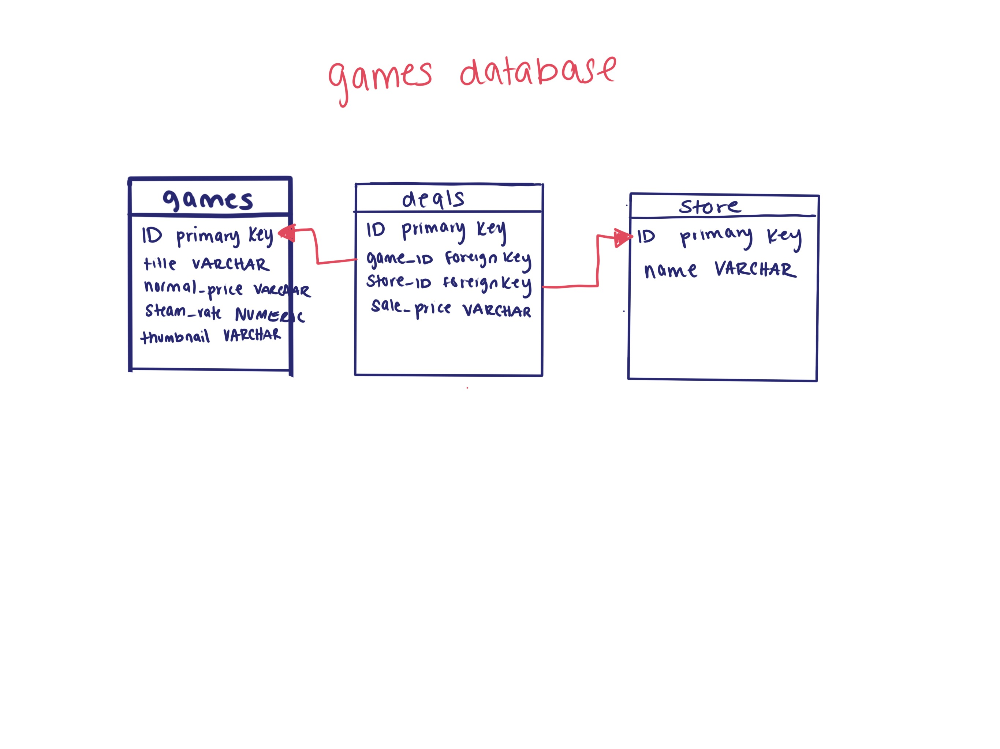

# Price Comparison 

**Author**: Aysia, Kimberly, Garrett & Ryan 
**Version**: 1.0.0 (increment the patch/fix version number if you make more commits past your first submission)

## Overview
<!-- Provide a high level overview of what this application is and why you are building it, beyond the fact that it's an assignment for a Code 301 class. (i.e. What's your problem domain?) -->

## User Stories

1. User: As a user I want to be able to select a popular game title and compare prices to find the best deal
2. User: As a user I would like to be able to search for a popular title from a list and compare prices to find the best deal
3. server: As the website creator I would like users to be able to search for a game, save the results in a database, retrieve that result from the database, and have those deals show up on a second page.
4. server: as the website creator I would like users to be able to pick from a selection of popular titles, retrieve that information from a database, and display the deals on a second page.
5. retailer: as a video game retailer I would like my businesses data to display when my marketplace has the best deal

## Software Requirements

The vision of this product is to allow users to be able to find the best deals on video game titles
This application solves the problem of users being able to find the best deals on video game titles they are interested in
This product should be cared about because it is intended to save you money as a potential user

## Scope

This product will display a list of popular titles on the homepage
This product will allow you to select from the list of popular titles to find the best deals on that title
This product will display your selection on a second page along with the deals associated with the selected title
This product will display your selections Steam rating and deal rating(s)

## MVP Goals

The MVP for our application is to display a list of popular titles and a search bar on our homepage
to save user selections into a database
to retrieve database data and display relevent results on a second page
to help users find the best deal!
Stretch goals: being able to look up multiple games at a time and display their results concurrently

## Functional requirements

A user can search for a game title
A user can select from a list of popular game titles
A user can view their selection on a second page
A user can view the steam rating and deals on the second page
The users selection will be saved into a database

## Non-Functional requirements

1. Usability: We will utilize unmoderated remote usability testing to conscript the community to assist in ensuring a user-friendly and bug-minimal application
2. Testability: We will design our own product testing to ensure that our application is functional and provides the friendly experience we want our users to have. We will do this by manually going through our page to test out our site and creating a list of items we want to improve upon.

## Models
### Domain Model

### Database ERD

## Getting Started
<!-- What are the steps that a user must take in order to build this app on their own machine and get it running? -->

1. Go to the applications website

## Architecture
<!-- Provide a detailed description of the application design. What technologies (languages, libraries, etc) you're using, and any other relevant design information. -->

The following languages are used in our app: HTML, CSS, JavScript. The library used for the app is jQuery. 

## Change Log
<!-- Use this area to document the iterative changes made to your application as each feature is successfully implemented. Use time stamps. Here's an examples:

01-01-2001 4:59pm - Application now has a fully-functional express server, with GET and POST routes for the book resource.

## Credits and Collaborations
<!-- Give credit (and a link) to other people or resources that helped you build this application. -->

--> 10.23.2020 Price Comparison Repo has been initiated. 

---
